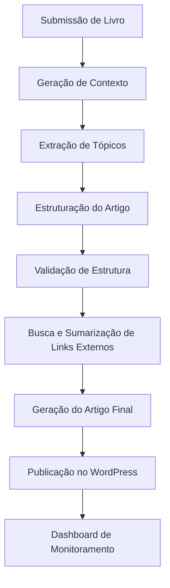

# Projeto Pigmeu - Resumo Técnico

## 1. Visão Geral

**Objetivo Principal**:
Sistema automatizado para geração de artigos estruturados sobre livros, com publicação integrada no WordPress. O projeto visa criar conteúdo SEO-otimizado a partir de informações de livros, enriquecido com pesquisa externa e formatação profissional.

## 2. Arquitetura e Tecnologias

### Stack Tecnológica:
- **Backend**: Python
- **Banco de Dados**: MongoDB (collection `prompts`)
- **Mensageria**: Redis (para filas de tarefas)
- **Integrações**:
  - API da OpenAI (LLM para geração de conteúdo)
  - API do WordPress (publicação de artigos)
  - Scraping de links externos
- **Infraestrutura**:
  - Docker/Docker Compose
  - Serviços: `pigmeu-api`, `pigmeu-worker`, `pigmeu-redis`

### Variáveis de Ambiente Necessárias:
```
MONGODB_URI
OPENAI_API_KEY
WORDPRESS_URL
WORDPRESS_USERNAME
WORDPRESS_PASSWORD
```

## 3. Fluxo Principal (Workflow)



## 4. Funcionalidades Principais

### Features Críticas (🔴):
1. **Prompts Iniciais/Seed**
   - Script `scripts/seed_prompts.py` para inserir prompts no MongoDB
   - Prompts para: extração de metadados, geração de contexto, geração de artigo, extração de tópicos, sumarização de links

2. **Estrutura de Artigo Conforme Spec**
   - Classe `ArticleStructurer` em `src/workers/article_structurer.py`
   - Métodos:
     - `extract_topics`: Extrair 3 tópicos principais do livro
     - `structure_article`: Estruturar markdown com 1 H1 + 8 H2 (3 temáticas + 5 fixas)
     - `validate_article`: Validar word count (800-1333 palavras) e hierarquia de títulos

3. **Busca e Sumarização de Links Externos**
   - Tarefa `scrape_links_task` para buscar 3 links relevantes sobre o livro
   - Scraping e sumarização do conteúdo

4. **WordPress Publishing Pipeline**
   - Publicação via API WordPress
   - Endpoints para gerenciamento de artigos

### Features de Alta Prioridade (🟡):
1. **Extração de Tópicos Dinâmicos**
   - Criação de seções temáticas baseadas no conteúdo do livro

2. **Validação de Word Count e Estrutura**
   - Garantir mínimo de 150 palavras por seção H2
   - Validação de hierarquia de títulos

3. **Editor de Artigo Antes de Publicar**
   - Endpoint `POST /tasks/{id}/draft_article`
   - Interface para revisão e edição manual

4. **Filtro e Busca na Dashboard**
   - Filtros por status e busca por título/autor

## 5. Requisitos Técnicos

### Estrutura de Artigo:
- **Títulos**: 1 H1 + 8 H2 (3 temáticas + 5 fixas)
- **Subtítulos**: 1 H2 com 2-4 H3
- **Word Count**: 800-1333 palavras totais
- **Seções**: Mínimo 150 palavras por H2 (exceto seções fixas pequenas)

### Componentes Principais:
1. **API** (`pigmeu-api`):
   - Endpoints para submissão de livros e gerenciamento de tarefas

2. **Worker** (`pigmeu-worker`):
   - Processamento assíncrono de tarefas
   - Geração de contexto e artigos

3. **Dashboard**:
   - Monitoramento de tarefas
   - Filtros e busca

## 6. Estrutura de Diretórios (Parcial)
```
pigmeu/
├── docs/
│   ├── continue-history/  # Históricos das sessões
├── infra/
│   └── docker-compose.yml  # Configuração Docker
├── scripts/
│   └── seed_prompts.py     # Script para inserir prompts iniciais
├── src/
│   └── workers/
│       ├── article_structurer.py  # Classe para estruturação de artigos
│       └── article_generator.py   # Geração de artigos
```

## 7. Plano de Implementação (Fases)

### Fase 1: Essencial (~5h)
- Prompts iniciais/seed
- Estrutura de artigo conforme spec
- Validação básica

### Fase 2: Core (~12h)
- Busca e sumarização de links externos
- WordPress Publishing Pipeline
- Extração de tópicos dinâmicos

### Fase 3: Polish (~6h)
- Editor de artigo antes de publicar
- Filtro e busca na dashboard
- Métricas e testes de ponta a ponta

## 8. Dependências Externas
- API da OpenAI (para geração de conteúdo via LLM)
- API do WordPress (para publicação de artigos)
- Serviços de busca na web (para links externos)

## 9. Documentação Necessária
- SETUP.md (configuração inicial)
- API.md (documentação da API)
- Guia de contribuição
- Documentação técnica dos workers

---
**Nota**: Este documento foi reconstruído a partir dos históricos de interações com agentes. Algumas informações podem estar incompletas ou requerer validação adicional.